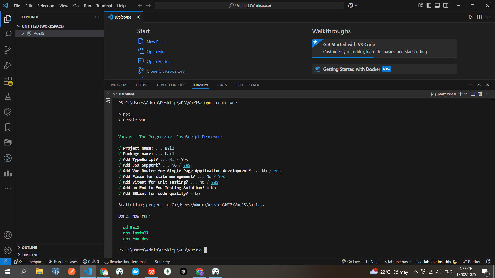
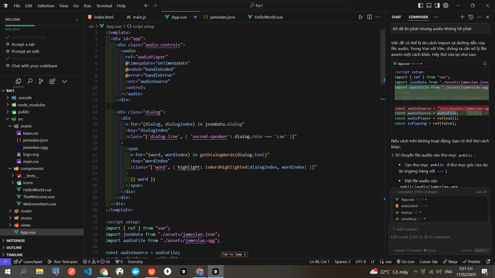
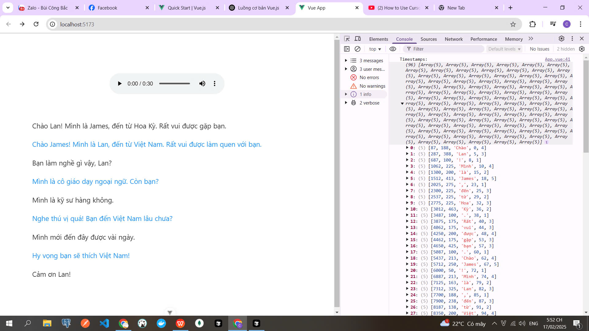
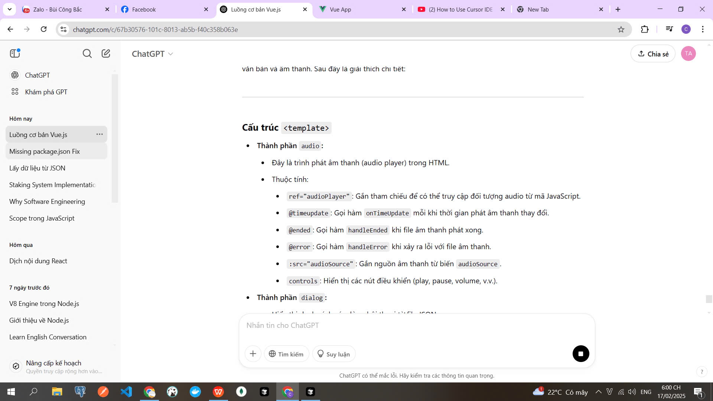
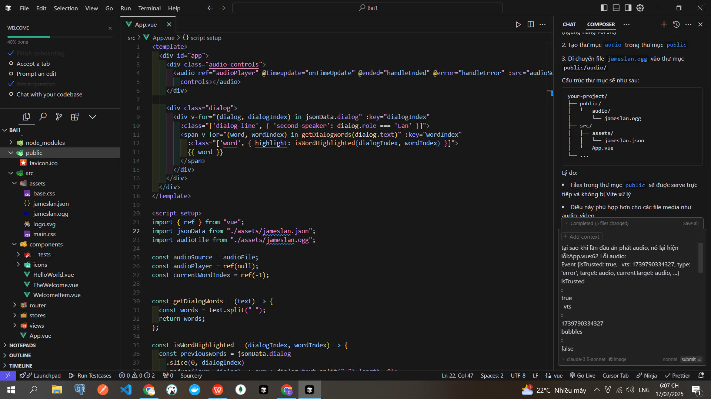
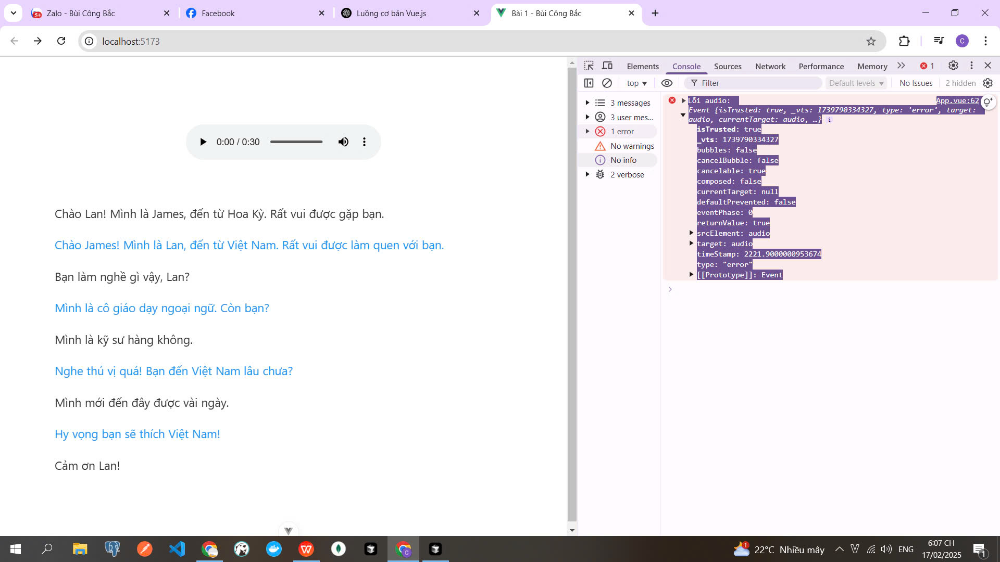
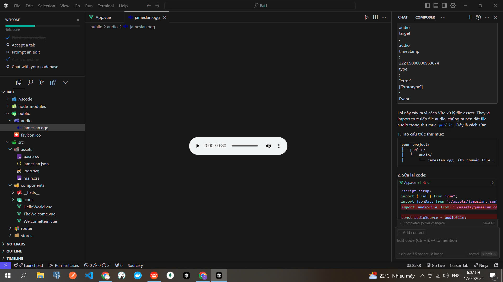
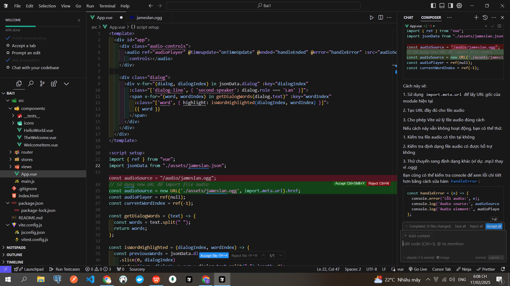

# Ứng Dụng Đọc Văn Bản Đồng Bộ Với Âm Thanh

Đây là một ứng dụng Vue.js cho phép người dùng nghe audio và xem văn bản được đồng bộ hóa theo thời gian thực. Khi audio phát, từng từ trong đoạn hội thoại sẽ được highlight tương ứng với thời điểm phát âm.

## Tính Năng Chính

### 1. Phát Audio Với Điều Khiển

- Người dùng có thể phát/dừng audio bằng các nút điều khiển chuẩn của trình duyệt
- Hỗ trợ tua tiến/lùi
- Hiển thị thời gian phát hiện tại

### 2. Hiển Thị Hội Thoại

- Hiển thị đoạn hội thoại giữa hai người (James và Lan)
- Phân biệt rõ ràng giữa hai người nói bằng màu sắc khác nhau:
  - James: Màu mặc định (#333)
  - Lan: Màu xanh (#2196f3)

### 3. Đồng Bộ Hóa Văn Bản-Âm Thanh

- Highlight từng từ theo thời gian thực khi audio đang phát
- Sử dụng dữ liệu timestamp để đồng bộ chính xác từng từ với audio
- Tự động bỏ highlight khi audio kết thúc

## Cấu Trúc Dữ Liệu

### File Audio

- Định dạng: OGG
- Đường dẫn: `/assets/jameslan.ogg`

### Dữ Liệu Hội Thoại (jameslan.json)

## Cách Hoạt Động

1. **Khởi Tạo**

   - Load dữ liệu hội thoại từ file JSON
   - Khởi tạo audio player với file âm thanh

2. **Xử Lý Sự Kiện Audio**

   - `@play`: Ghi nhận khi audio bắt đầu phát
   - `@timeupdate`: Cập nhật highlight theo thời gian hiện tại
   - `@ended`: Reset trạng thái highlight khi kết thúc
   - `@error`: Xử lý các lỗi phát sinh

3. **Đồng Bộ Hóa**
   - Theo dõi thời gian hiện tại của audio (`currentTime`)
   - So sánh với dữ liệu timestamp để xác định từ cần highlight
   - Cập nhật class CSS cho từ tương ứng

## Giao Diện Người Dùng

- Thiết kế tối giản, dễ sử dụng
- Responsive design thích ứng với các kích thước màn hình
- Điều khiển audio đặt ở vị trí thuận tiện
- Văn bản hội thoại được định dạng rõ ràng, dễ đọc

## Yêu Cầu Kỹ Thuật

- Vue 3
- Modern browser hỗ trợ HTML5 Audio
- JavaScript enabled

## Hướng Dẫn Cài Đặt

1. Cài đặt dependencies

```bash
npm install
```

2. Chạy development server

```bash
npm run dev
```

3. Build cho production

```bash
npm run build
```

## Quá trình làm










